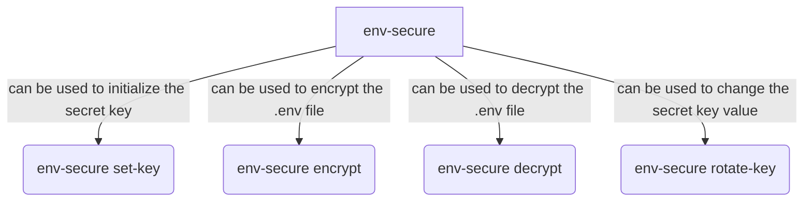

# env-secure

`env-secure` is a powerful command-line utility designed to safeguard your `.env` files by encrypting sensitive environment variables using **AES-256 encryption**. With `env-secure`, you can ensure that your secret keys, API keys, and other sensitive data are securely stored and only accessible to authorized users. The tool also supports key rotation, allowing you to update your encryption key without compromising security. Whether you're working locally or in a team, `env-secure` provides a simple and secure way to manage your environment variables.

---

## Table of Contents

1. [Installation](#installation)
2. [Usage](#usage)
   - [Set the Secret Key](#set-the-secret-key)
   - [Encrypt a `.env` File](#encrypt-a-env-file)
   - [Decrypt a `.env.enc` File](#decrypt-a-envenc-file)
   - [Rotate the Secret Key](#rotate-the-secret-key)
3. [Security Considerations](#security-considerations)
4. [How It Works](#how-it-works)
5. [Contributing](#contributing)
6. [License](#license)

---

## Installation

To install `env-secure`, you need to have [Node.js](https://nodejs.org/) installed on your system. Once Node.js is installed, run the following command:

```bash
npm install -g env-secure
```

This will install `env-secure globally`, allowing you to use it from any directory.

---

## Usage

### Overview of the commands:



### Set the Secret Key:

Before encrypting or decrypting your `.env` file, you need to set a **secret key**. This key is used for encryption and decryption.

```bash
env-secure set-key
```

You will be prompted to enter a secret key. This key will be saved in your `.env` file under the `ENV_SECURE_KEY` variable.

**Example:**

```bash
$ env-secure set-key
Enter your secret key: my-secret-key
Secret key saved successfully.
```

### Encrypt a `.env` File:

To encrypt your `.env` file, run the following command:

```bash
env-secure encrypt
```

You will be prompted to enter a passphrase. This passphrase is used to encrypt the secret key, ensuring that no part of the `.env.enc` file is stored in plain text.

**Example:**

```bash
$ env-secure encrypt
Enter your passphrase: my-passphrase
Successfully encrypted .env to .env.enc.
```

This will create an encrypted `.env.enc` file and delete the original `.env` file.

### Decrypt a `.env.enc` File:

To decrypt your `.env.enc` file, run the following command:

```bash
env-secure decrypt
```

You will be prompted to enter the passphrase you used during encryption. If the passphrase is correct, the `.env.enc` file will be decrypted, and the original `.env` file will be restored.

**Example:**

```bash
$ env-secure decrypt
Enter your passphrase: my-passphrase
Successfully decrypted .env.enc to .env.
```

### Rotate the Secret Key:

To rotate the secret key, run the following command:

```bash
env-secure rotate-key
```

You will be prompted to:

Enter your **current secret key**.

Enter your **new secret key**.

**Example:**

```bash
$ env-secure rotate-key
Enter your current secret key: my-secret-key
Enter your new secret key: my-new-secret-key
Secret key updated successfully.
```

This will update the secret key in the `.env` file. ***No encryption or decryption is performed during rotation***.

---

## Security Considerations

1. Secret Key:

    * The secret key is used for encrypting and decrypting your .env file. Keep it secure and do not share it.

    * If the secret key is compromised, rotate it immediately using the rotate-key command.

2. Passphrase:

    * The passphrase is used to encrypt the secret key. Choose a strong passphrase and do not share it.

    * If the passphrase is forgotten, the .env.enc file cannot be decrypted.

3. Encrypted File:

    * The .env.enc file contains no plain text. All data, including the secret key, is encrypted.

    * Store the .env.enc file securely and do not share it.

4. Backup:

    * Always keep a backup of your original .env file before encrypting it.

---

## How It Works

**Encryption Process**

1. The secret key is encrypted using a passphrase-derived key.

2. The encrypted secret key is stored in the `.env.enc` file as the first line.

3. The rest of the `.env` file is encrypted using the secret key.

4. The original `.env` file is deleted after encryption.

**Decryption Process**

1. The encrypted secret key is extracted from the `.env.enc` file.

2. The secret key is decrypted using the passphrase-derived key.

3. The rest of the `.env.enc` file is decrypted using the secret key.

4. The original `.env` file is restored, and the `.env.enc` file is deleted.

**Rotation Process**

1. The secret key in the `.env` file is updated.

2. No encryption or decryption is performed during rotation.

---

## Contributing

Contributions are welcome! If you find a bug or have a feature request, please open an issue on the [GitHub repository](https://github.com/Dhruv9051/env-secure).

To contribute code:

- Fork the repository.

- Create a new branch for your feature or bug fix.

- Submit a pull request.

---

## License

This project is licensed under the MIT License. See the [LICENSE](https://github.com/Dhruv9051/env-secure?tab=MIT-1-ov-file) file for details.

---

## Support

If you have any questions or need help, please open an issue on the [GitHub repository](https://github.com/Dhruv9051/env-secure) or contact me through [Email](mailto:dhruvsuvarna30@gmail.com).

